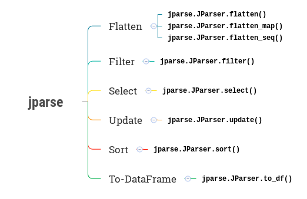

.. jparse documentation master file, created by
   sphinx-quickstart on Mon Aug 13 11:16:21 2018.
   You can adapt this file completely to your liking, but it should at least
   contain the root `toctree` directive.

What Include ?
====================

**jparse** is really small library which has only one module `jparse`, one class ``JParser``  with
instance methods.

-----

.. automethod:: jparse.JParser.flatten

-----

.. automethod:: jparse.JParser.flatten_seq

-----

.. automethod:: jparse.JParser.flatten_map

-----

.. automethod:: jparse.JParser.filter

-----

.. automethod:: jparse.JParser.select

-----

.. automethod:: jparse.JParser.update

-----

.. automethod:: jparse.JParser.sort

-----

.. automethod:: jparse.JParser.to_df
